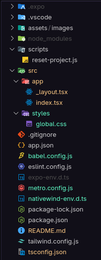

# **TRAINUP**

## Aplicativo para a disciplina de Programação para Dispositivos Móveis  

A disciplina de **Programação para Dispositivos Móveis** estabelece como atividade avaliativa o desenvolvimento de uma aplicação prática ao longo do semestre.  
<<<<<<< HEAD
A proposta apresentada pela equipe composta por **Marcelo Teixeira de Sousa Filho** e **Rafaela ...** consiste no **TrainUp**, um aplicativo voltado para a **gestão de treinos em academias**.  
=======
A proposta apresentada pela equipe composta por **Marcelo Teixeira de Sousa Filho** e **Rafaela Oliveira Lorenzeto Braga** consiste no **TrainUp**, um aplicativo voltado para a **gestão de treinos em academias**.  
>>>>>>> dac7c3e (Salvando alterações/tela Perfil pronta)

O aplicativo permitirá ao usuário:  
- Acessar notícias e comunicados da academia, como horários de funcionamento em feriados e finais de semana.  
- Consultar o status de pagamento de sua mensalidade.  
- Visualizar, de forma prática e organizada, sua ficha de treino diretamente no celular.  

---

## Estrutura  

A aplicação será desenvolvida utilizando **React Native** em conjunto com o **Expo**, que tem como principal objetivo facilitar a prototipação do projeto e permitir a visualização diretamente em dispositivos móveis.  

Para a estilização, será empregado o **Tailwind CSS** (via **Nativewind**, adaptado ao React Native), o que possibilitará a criação de uma interface moderna, responsiva e com suporte a animações de maneira simplificada e componentizada.  

<p align="center">
   
</p>

A imagem acima apresenta a estrutura inicial de diretórios do projeto, organizada da seguinte forma:  

```bash
.
├── .expo/                  # Configurações do Expo
├── .vscode/                # Configurações do editor VSCode
├── assets/                 # Recursos estáticos (imagens, ícones, etc.)
├── node_modules/           # Dependências do projeto
├── scripts/
│   └── reset-project.js    # Script auxiliar
├── src/
│   ├── app/
│   │   ├── _layout.tsx     # Layout principal
│   │   └── index.tsx       # Ponto inicial de rotas
│   └── styles/
│       └── global.css      # Estilização global
├── .gitignore
├── app.json
├── babel.config.js
├── eslint.config.js
├── expo-env.d.ts
├── image.png
├── metro.config.js
├── nativewind-env.d.ts
├── package-lock.json
├── package.json
├── README.md
├── tailwind.config.js
└── tsconfig.json
```

---

## Como executar o projeto

Para utilizar localmente, basta seguir os seguintes passos após clonar do GitHub:

1. Pré-requisitos:
   
   - Node.js instalado (versão LTS recomendada)
   - Expo CLI instalado globalmente

   ```bash
   npm install -g expo-cli
   ``` 

   - Aplicativo Expo Go instalado no celular
---
2. Clonar o repositório

```bash
git clone https://github.com/marcelotsfilho/trainup.git
cd trainup
```
---
3. Instalar as dependências
```bash
npm install
```
---
4. Iniciar o servidor de desenvolvimento
```bash
npx expo start
```
---
5. Executar a emulação no celular
   
   - Abra o aplicativo Expo Go em seu dispositivo móvel 
   - Escaneie o QR Code gerado no terminal após iniciar o **passo 4**
   - A aplicação será carregada automaticamente no seu dispositivo móvel

---
